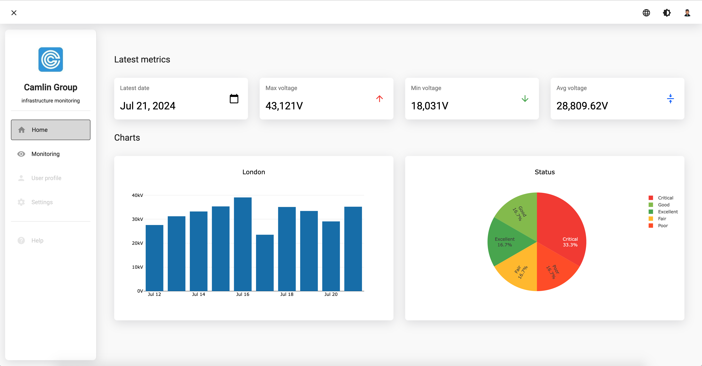
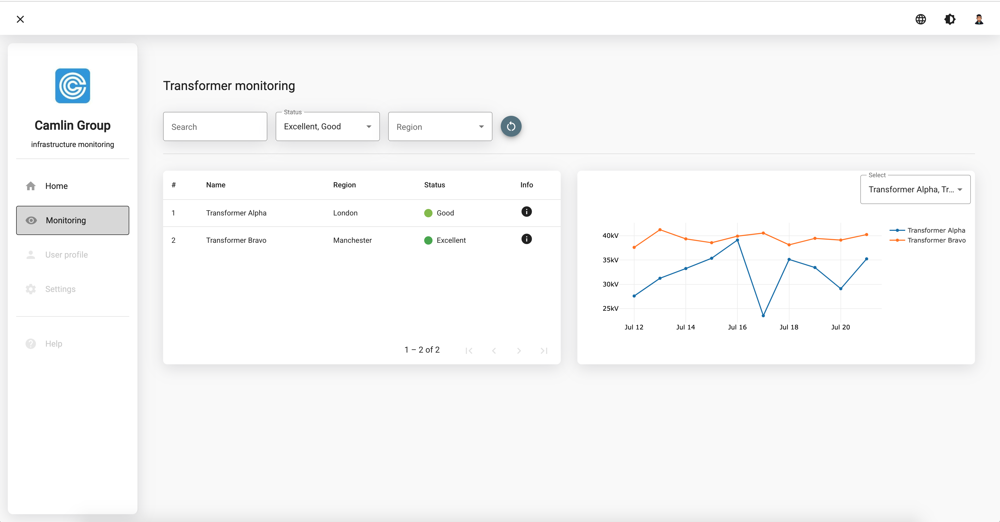
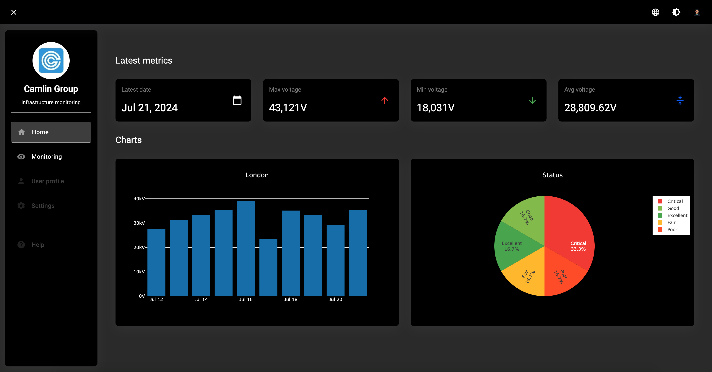
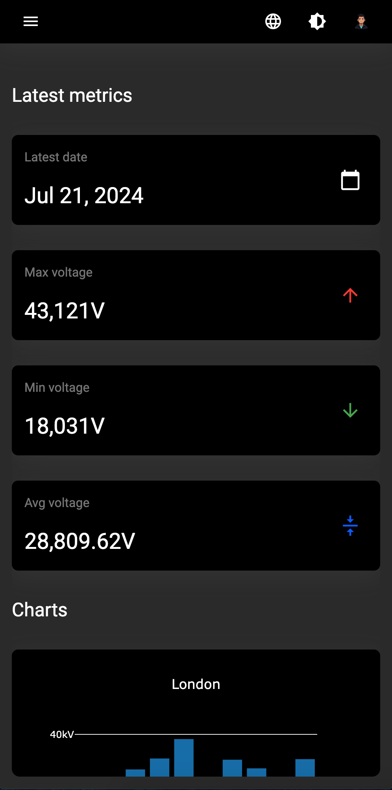

# Camlin Group Tranformer Monitoring

This is a small web application to display/visualize transformer data in table and chart view 

Live Demo: https://transfomermonitoring.onrender.com/

**Home page:**



**Monitoring page:**



**Dark theme and responsive:**

<div style="display: flex; flex-direction: column; gap: 20px">


</div>

## Requirements

This project is build and tested on Node.js Version v22.17.0 (should work on 20.11.1 or later)


## Installing
```bash
npm ci
```


## Development server

To start a local development server, run:

```bash
npm start
```

Once the server is running, open your browser and navigate to `http://localhost:4200/`. The application will automatically reload whenever you modify any of the source files.


## Building

To build the project run:

```bash
npm run build
```

This will compile your project and store the build artifacts in the `dist/` directory. By default, the production build optimizes your application for performance and speed.


